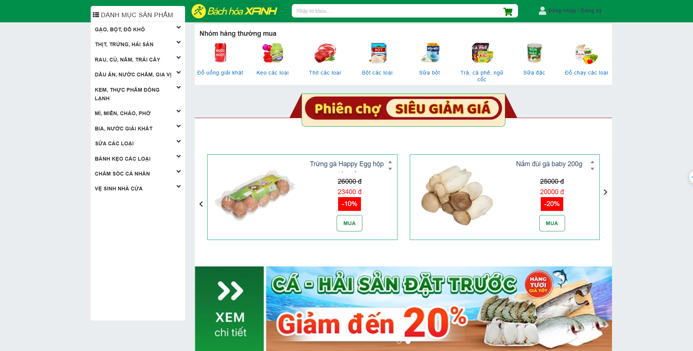

# Tóm Tắt Dự Án: Cửa Hàng Bách Hóa Xanh

## 1. Tổng Quan Dự Án
- **Tên dự án**: Cửa Hàng Bách Hóa Xanh
- **Mô tả**: Hệ thống quản lý bán hàng trực tuyến và tại cửa hàng với các chức năng hỗ trợ người dùng mua sắm, quản lý hàng hóa, và phân quyền quản trị.
- **Tài liệu tham khảo**: [https://www.bachhoaxanh.com/]

---

## 2. Thành Viên Tham Gia
- **Trần Trung Tín** 
- **Võ Chí Khoa** 
- **Phùng Hoàn Chiến** 
- **Phạm Ngọc Duy** 

---

## 3. Các Chức Năng Chính
### 3.1 Đăng Ký
- Người dùng có thể tạo tài khoản bằng cách nhập thông tin: tên đăng nhập, email, mật khẩu.
- Kiểm tra điều kiện tên đăng nhập, mật khẩu và thông báo lỗi nếu không hợp lệ.
    

### 3.2 Đăng Nhập
- Người dùng nhập tên đăng nhập và mật khẩu để truy cập hệ thống.
- Phân quyền:
  - Người dùng thông thường: truy cập giao diện mua sắm.
  - Admin: truy cập giao diện quản trị.
    

---

## 4. Giao Diện Người Dùng
Dưới đây là hình ảnh minh họa giao diện dành cho người dùng:

---

## 5. Giao Diện Admin
Dưới đây là hình ảnh minh họa giao diện dành cho quản trị viên:

---
